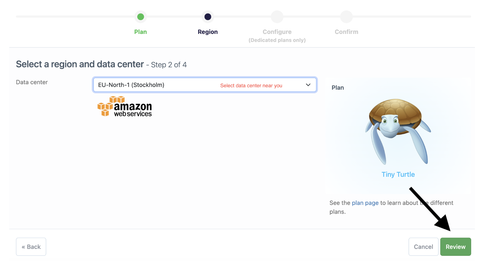

## Deployment

### Database Deployment

**I used [elephantssql](https://www.elephantsql.com/). You can create an account [here](https://customer.elephantsql.com/signup)**

<u>After</u>  creating an account, follow these steps:

**Step 1:** Click "Create New Instance".


**Step 2:** Select a name. Use the Free plan. Then click "Select region".


**Step 3:** Select a data center near you. Then click "Review".



**Step 4:** Confirm your instance and click "Create instance".


**Step 5:** Click on your instance name.


**Step 6:** Copy the URL.

*Everything is done in ElephantSQL. Now, save the URL you copied somewhere safe.*

---

## Production deployment

These deployment instructions are intended for developers who wish to clone and publish this project. I understand that deployment is a complex process, and I will create a more beginner-friendly version. This version will have step-by-step guidance and additional information on project configuration, and how to enable DEV mode.
I appreciate your patience in the meantime.

### Steps:

Pre-requisities; to make sure everything is compatible, use the same versions as I:

* Python version **3.11.4**

* Django version **3.2.20**

* Node version **v16.20.2**

* Npm version **8.19.4**

**Step 1:** Clone this repository.

```git clone https://github.com/bianca9901/todo.git```

**Step 2:** type ```cd ..``` in the terminal to go to the root directory.

**Step 3:** Create a virtual environment.

* ```python3 -m venv venv```

* ```source venv/bin/activate```

**Step 4:** Install all dependencies.

```pip install -r requirements.txt```

**Step 5:** Create an ```env.py``` file.

```touch env.py```

**Step 6:** Add the following lines to ```env.py```:


import os

```os.environ.setdefault("SECRET_KEY", "Your secret key here")```

```os.environ["DATABASE_URL"] = "Your database URL here"```

``` os.environ['ALLOWED_HOST'] = "Your allowed hosts here" ```

``` os.environ['CLIENT_ORIGIN'] = "Your client origin here" ```


**Step 7:** Migrate:
1. ```pip manage.py makemigrations```
2. ```pip manage.py migrate```


**Step 8:** type ``` cd frontend ``` in to go to the frontend directory.


**Step 9:** type ```` npm install ``` to install the frontend dependencies.


**Step 10:* if you make any changes to the static files, including the react files, you need to run this command. 

``` npm run build && rm -rf ../staticfiles/build && mv build ../staticfiles/. ```

If you dont want to make any changes, you can skip it.


**Step 11** Test the project by running this command:

``` python3 manage.py runserver ```

*Local Deployment done! I hope it went well.*


## Heroku Deployment
**If you don't have a Heroku account. Create an account [here](https://signup.heroku.com/)**

<u>After</u>  creating an account, follow these steps:

**Step 1:** Click "Create New App".


**Step 2:** Select a name and your region and click "Create app."


**Step 3:** In your newly created app's dashboard, navigate to the "Settings" tab.


**Step 4:** Click on "Reveal Config Vars" and add the following Config Vars:


!

**Config Vars:** 

* ALLOWED_HOSTS = your Heroku domain name (Remove the https:// at the beginning
and remove the trailing slash at the end) *in the key field.*

* DATABASE_URL = your database URL *in the key field.*

* SECRET_KEY = your secret key *in the key field.*

* CLIENT_ORIGIN = your Heroku domain name (Keep the https:// at the beginning but remove the trailing slash at the end) *in the key field.*


**Step 6:** Navigate to the "Deploy" tab.


**Step 7:** Connect to your GitHub account.


**Step 8:** Connect to your GitHub repository.


**Step 9:** Scroll down to "Manual Deploy" and click on "Deploy Branch".


**Step 10:** Click "View" to see your app.


*You have published the project! I hope it went well.*

---
