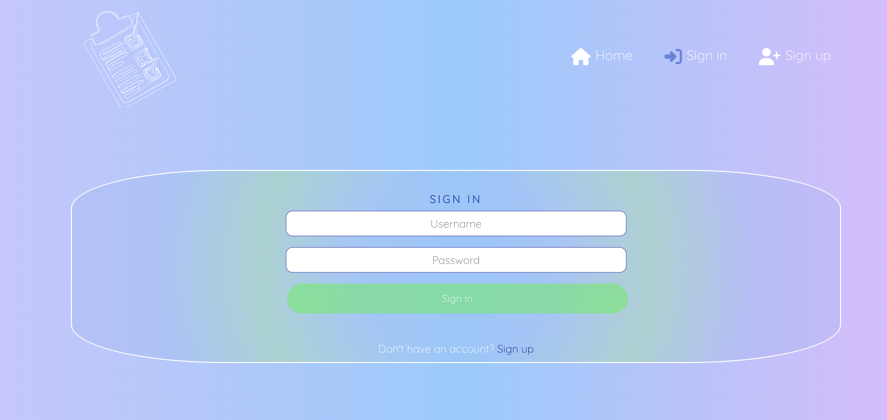
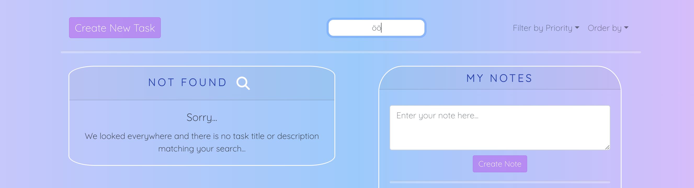

# Todo

## About

### Todo is a website designed to inspire you to be more productive. Whether you are a professional juggling work tasks or a student managing assignments, ToDo will help you stay on track with all the things you need to get done.

You can explore the website by visiting it [here](https://todo-bianca-9a72e771f0e2.herokuapp.com/).

**Todo Main Features:**

- **Create and organize tasks efficiently.**

- **Set due dates and priorities for each task.**

- **Easily edit or mark tasks as completed.**

- **Search, filter, and sort tasks for easy access.**

- **Take quick notes alongside the tasks.**

---

## Main features

### Home:
**Home page for not authenticated users:**

**Home page for authenticated users:**

### Sign in:

### Sign up:

### Create Task:

### Edit Task:

### Profile:

## User Stories

### I followed the Agile methodology throughout, it helped me to stay on track and motivated me to get stories done one by one.

---
## Design

#### Main colors used:

RGB(255, 255, 255)

RGB (106, 130, 217)

RGB (133, 194, 222)

RGB (163, 200, 251)

RGB (203, 191, 251)

RGB(157, 197, 208)

RGB(182, 140, 242)

#### Colors used for buttons:

RGB(147, 147, 147)

RGB(199, 122, 139)

RGB(143, 218, 170)

### Typography: 

### I used [Google Fonts](https://fonts.google.com/) for all text:**

**I used Quicksant Light 300.**

## Testing

Please visit [this link](TESTING.md) to find test-related documentation.

---

## Deployment

Please visit [this link](DEPLOYMENT.md) to find deployment-related documentation.

---

## Pages

- **/** (TasksAll.js) Allows users to see their tasks and notes.

- **/signin** (SignInForm.js) Allows the user to sign in.

- **/signup** (SignUpForm.js) Allows users to sign up.

- **/profile** (MyProfile.js) Allows users to see their username and account creation date.

- **/task/create** (TaskCreateForm.js) Allows users to create a task.

- **/task/edit** (TaskEditForm.js) Allows users to edit their tasks.

---

## Component dictionary

**TasksAll**
As seen underneath in "usage", the `TasksAll` aka "/" homepage, serves as the central hub for the website. As the parent component, most API calls are made from here, including fetching, deleting, and marking tasks as completed. However, modularization has been thought of and NavTask.js and TaskListItem.js are direct children of TasksAll inheriting the necessary props for the reason of separation of concerns.

### Asset.js

**Description:** Asset.js includes a Bootstrap loading spinner animation.

**Purpose:** This spinner provides users with a visually pleasing loading indicator that reassures them that the application is working.

**Usage:** Asset.js is utilized in src/pages/tasks/TasksAll and src/pages/profile/MyProfile.

### NavBar.js

**Description:** NavBar.js is a navigation component that features the logo, links to the home page, sign-out (for authenticated users), as well as sign-up and sign-in links (for unauthenticated users).

**Purpose:** It simplifies navigation for users, allowing them to move across the website.

**Usage:** NavBar.js is a global component utilized in App.js, ensuring the navigation options across all pages.

### NavTask.js

**Description:** NavTask.js is a nav component made for task-related functionality, including search, sorting, and filtering options.

**Purpose:** It lets users effortlessly find tasks that match their criteria.

**Usage:** NavTask.js is utilized within src/pages/tasks/TasksAll.

### NoResultsError.js

**Description:** NoResultsError.js provides a user-friendly message informing users that their search in the NavTask.js component found no results. It is rendered in place of the task list.

**Purpose:** To notify users that their search did not find any matching task titles or descriptions.

**Usage:** NoResultsError.js is utilized within src/pages/tasks/TasksAll.

### NotAuthenticated.js

**Description:** NotAuthenticated.js is a user-friendly welcome message encouraging users to log in or create an account.

**Purpose:** It serves as the homepage for not authenticated users and acts as a fallback for protected routes.

**Usage:** NotAuthenticated.js is utilized within src/pages/profile/MyProfile, src/pages/tasks/TasksAll, src/pages/tasks/TaskCreateForm, and src/pages/tasks/TaskEditForm.

### NoTasks.js

**Description:** NoTasks.js is a user-friendly message component indicating that the user has no tasks.

**Purpose:** It guides newly signed-up users on where their tasks will be displayed once they start adding them. Additionally, it serves as a fallback when users delete all their tasks.

**Usage:** NoTasks.js component is utilized within src/pages/tasks/TasksAll.

### TaskListItem.js
**Description:** TaskListItem.js is responsible for rendering individual task items and displaying buttons such as "Show Details," "Hide Details," "Delete," "Mark Task as Completed/Uncompleted," and a link to the "Edit" task form. It inherits props from its parent component, TasksAll, to manage button clicks for deletion and marking tasks as completed. It also manages its own state for showing and hiding task details and a confirm deletion modal.

**Purpose:** To efficiently display and manage task-related actions at the item level.

**Usage:** TaskListItem.js is utilized within src/pages/tasks/TasksAll.

### Note.js
**Description:** Note.js handles the retrieval, creation, and deletion of user notes. It renders alongside tasks, providing a quick way to write down notes.

**Purpose:** To offer users a fast and straightforward method for creating and managing notes.

**Usage:** Note.js is utilized within src/pages/tasks/TasksAll.

**Folder structure**
Components are organized within the src directory in the components folder, each component has an associated stylesheet in the src/styles directory, sharing the same file name as the component for convenient access.

---
## Data Schema

### The application `tasks` has two models that represent tasks and notes.

**`tasks:`**

The `tasks` model represents tasks associated with the user.

Fields:
- `owner`: The owner of the task
- `title`: The name of the task.
- `due_date`: The date and time the task should be completed.
- `description`: A text field describing the task or for additional notes.
- `completed`: A boolean representing if the task is marked as completed/uncompleted.
- `created_at`: A timestamp to when the task was created/updated.
- `priority`: A option field to select by "High", "Medium", or "Low".

| Name        | Database Key | Field Type         | Validation                            |
| ----------- | ------------ | ------------------ | ------------------------------------- |
| owner       | owner        | ForeignKey         | to=User, on_delete=models.CASCADE     
| created_at  | created_at   | DateTimeField     | auto_now_add=True                      |
| updated_at  | updated_at   | DateTimeField     | auto_now=True                          |
| title       | title        | CharField          | max_length=255                        |
| description | description  | TextField          | blank=True, null=True                 |
| due_date    | due_date     | DateTimeField     | default=timezone.now                   |
| completed   | completed    | BooleanField      | default=False                          |
| priority    | priority     | CharField          | max_length=10, choices=[("Low", "Low"), ("Medium", "Medium"),("High", "High")], blank=True, null=True |
---

**`note`**

The `note` model represents notes associated with the user.

Fields:
* `owner`: The owner of the note.
* `content`: The text content of the note.
* `created_at`: This is not used.

| Name       | Database Key | Field Type     | Validation                  |
| ---------- | ------------ | -------------- | --------------------------- |
| owner      | owner        | ForeignKey     | to=User, on_delete=models.CASCADE |
| content    | content      | TextField      |                             |
| created_at | created_at   | DateTimeField | auto_now_add=True            |
---

### The application `profile` has one model that represents the profile of the user.
**`profile`**

Fields:
* `owner`: The account owner.
* `created_at`: A timestamp to when the account was created.
* `name`: This is not used.

The `profile` model represents a profile associated with a user.

| Name       | Database Key | Field Type     | Validation                  |
| ---------- | ------------ | -------------- | --------------------------- |
| owner      | owner        | OneToOneField  | to=User, on_delete=models.CASCADE |
| created_at | created_at   | DateTimeField | auto_now_add=True           |
| name       | name         | CharField     | max_length=255, blank=True  |
---

`profile`Methods:

- `create_profile`: This method is a signal handler function that creates a profile instance when a new user is created.

- `post_save.connect(create_profile, sender=User)`:  This connects the signal handler function to the User model's post_save signal. When a User instance is saved, this signal handler function is called to create a profile instance for the user.

----

## Technologies Used

### Languages

* [Python](https://www.python.org/): was used for the backend logic.

* [JavaScript](https://developer.mozilla.org/en-US/docs/Web/JavaScript): was used for the frontend logic.

* [CSS](https://developer.mozilla.org/en-US/docs/Web/CSS): was used to style the website.

### Frameworks and Libraries

* [React](https://react.dev/): was used for building the frontend interface.

* [Django REST framework](https://www.django-rest-framework.org/): was used for creating the API.

* [React Bootstrap](https://react-bootstrap-v4.netlify.app/): was used for responsive design and layout.

* [React datepicker](https://www.npmjs.com/package/react-datepicker): was used for date selection functionality.

* [Axios](https://axios-http.com/docs/intro): was used for making http requests.

### Databases

* [SQLite](https://www.sqlite.org/index.html): was used as a development database.

* [PostgreSQL](https://www.postgresql.org/): was the database used to store all the data.

## Other Technologies

* [json web token](https://jwt.io/): was used for user authentication.

* [Github](https://github.com/): was used for repository hosting, version control, and agile methologies.

* [Git](https://git-scm.com/): was used for version control.

* [Visual Studio Code](https://code.visualstudio.com/): was used for writing and editing code.

* [Heroku](https://id.heroku.com/login): was used to deploy the project.

* [npm](https://www.npmjs.com/): was used for package manager used to install the dependencies.

* [node](https://nodejs.org/en): was used for running JavaScript on the server side.

* [pip3](https://pypi.org/project/pip/): was the package manager used to install the dependencies.

* [Psycopg](https://pypi.org/project/psycopg2/): was used as the database adapter for Python.

* [Django Allauth](https://django-allauth.readthedocs.io/en/latest/): was used for authentication, registration, and account management.

* [Google Fonts](https://fonts.google.com/): was used for the typography.

* [Font Awesome](https://fontawesome.com): was used for the icons.

* [Canva](https://www.canva.com/): was used to make the wireframe and for sourcing images.

* [Css Gradient](https://cssgradient.io/) was used to make a gradient background throughout the website.

* [Postman](https://www.postman.com/) was used to make tests on the API.

---
