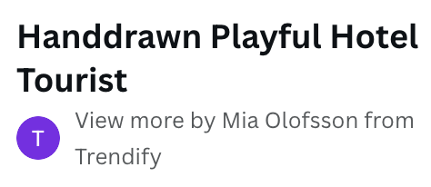

# Todo

## About

### Todo is a website designed to inspire you to be more productive. Whether you are a professional juggling work tasks or a student managing assignments, ToDo will help you stay on track with all the things you need to get done.

You can explore the website by visiting it [here](https://todo-bianca-9a72e771f0e2.herokuapp.com/).

**Todo Main Features:**

- **Create and organize tasks efficiently.**

- **Set due dates and priorities for each task.**

- **Easily edit or mark tasks as completed.**

- **Search, filter, and sort tasks for easy access.**

- **Take quick notes alongside the tasks.**

---

## Main features

### Home:
**Home page for not authenticated users:**

**Home page for authenticated users:**

### Sign in:

### Sign up:

### Create Task:

### Edit Task:

### Profile:

## User Stories

### I followed the Agile methodology throughout, it helped me to stay on track and motivated me to get stories done one by one.

---
## Design
### The design choice:

**I aimed to give the website a playful yet structured style, which is in line with the purpose of the website, that is, a happy and visually pleasing place to stay productive. The many different colors together with the stricter font made my vision come to life. The layout was meant to be slightly different, (more on this in wireframe), but altogether, the layout I planned in the wireframe came to life.**
### The color choice:

**I chose this color scheme to enhance the features of the app. Purple represents creativity and inspiration, which encourages the users to brainstorm the things they aim to achieve. Blue represents trust and reliability, making it the perfect choice for an app where the users' notes and tasks should be private to them. Green associated with growth and money was the choice to promote productivity as the user tackles their tasks.**

#### Main colors used:

RGB(255, 255, 255)

RGB (106, 130, 217)

RGB (133, 194, 222)

RGB (163, 200, 251)

RGB (203, 191, 251)

RGB(157, 197, 208)

RGB(182, 140, 242)

#### Colors used for buttons:

RGB(147, 147, 147)

RGB(199, 122, 139)

RGB(143, 218, 170)

### Typography: 

### I used [Google Fonts](https://fonts.google.com/) for all text:**

**I used Quicksant Light 300.**

## Wireframe:

While planning this project, I envisioned having both tasks and habits as the main features. However, given the limited timeframe, the inclusion of habits was not possible.

The wireframe difference from the finished product featured a third navigation bar that would allow users to toggle between tasks and habits. The goal was to create an engaging layout where Navigation 3 would adapt to whether habits or tasks were selected in Navigation2, interchanging the options for sorting and ordering based on whether tasks or habits were selected for display. It would also have a button that would change from Create New Task to Add New Habit depending on the selection in navigation2.

Although I had to set the habits feature aside for the time being, the database models for habits remain in the backend. I intend to revisit the original wireframe concept and reintroduce the habits component into the project. Due to time constraints, I introduced the 'notes' feature, which though unplanned complements the project functionality.

---

## Testing

Please visit [this link](TESTING.md) to find test-related documentation.

---

## Deployment

Please visit [this link](DEPLOYMENT.md) to find deployment-related documentation.

---

## Bugs and Features left to implement

As mentioned in the Wireframe section, the original idea behind this project was to have tasks and habits. However, given the limited timeframe, and drawing from my experience with learning new programming languages, libraries, and frameworks within tight schedules, I realized that prioritizing habits might not be durable, and therefore, no user stories were made in the beginning while planning the project. As it turned out, my intuition was correct, including habits was not an option in the end.

With limited experience in both React and Django REST framework, and a two-week timeframe, I had to deprioritize the habits feature. However, as mentioned earlier, the database models for habits remain, and I'm prepared to reintroduce this original idea.

Instead of habits, I introduced the 'notes' feature as an alternative, which although it was unplanned, integrates well into the project. In the future, I will return to the original wireframe concept, and use the 'notes' component in the user's profile, prompting them to write motivational messages. These messages will be displayed between Navigation 1 and Navigation 2 in the wireframe I made.

What I've learned from past experiences is that while planning is crucial, you must also recognize when it is necessary to let go of certain ideas due to time constraints. I encountered numerous bugs, which provided valuable lessons on tokens, authentication, date conversions and more. Unfortunately, these issues consumed a lot of time, preventing me from implementing the habits feature.

Several areas in this project can be improved, including defensive programming for task deletion, being able to access the account when forgetting a password, refining date conversions, fixing repetitive styling, and adding some exciting features to the profile page. Some aspects need to be fixed in this project, for example occasionally it encounters an unauthorized access bug, requiring a hard refresh.

As mentioned above, there are a few issues to fix, and there are several desirable additions to add.
Thus the project is not perfect, I can happily say that I've gathered a lot more knowledge throughout this very "bugable" experience that I would not have learned if everything went smoothly.

My plan after submission of the project involves firstly fixing the issues mentioned with the authorization bug hardcore refresh, adding defensive programming to task deletion, fixing repetitive styling, further modularization, and enhancing component reusability. And then adding features like habits, an improved user profile, and even user-to-user interactions for task assignment.

---

## Project Goals

With this project, I wanted to create something timeless and usable, something that anyone can use. I did not want a specific target group; I wanted this project to speak to anyone. Therefore, I went with a to-do website. This project can be used by anyone who wants to improve as a person, whether that means being more organized and structured with all tasks and notes in the same place or being more motivated to achieve their goals and dreams. My main question throughout planning and developing the project was, 'Would this be useful for the end user?' That drove my choices throughout.

Secondly, I had myself in focus. What did I want to personally achieve with this project? My main goal was to gain an understanding of the React architecture, working with APIs, and Django Rest Framework. In the end, I created full CRUD functionality for tasks, and I also had time to add create, read, and delete functionality for notes. I learned about React and its components and gained insight into advanced JavaScript concepts along the way. I was also introduced to serializers, HTTP requests, and much more.

In conclusion, with the final product, I can say that I learned more than I can express, but I know there is so much more to learn, and I am only at the beginning of my journey. However, in the role of a developer, you are never finished; there is always more to learn and room for improvement. Can this project improve? Yes, there is a lot of room, which is great. This project is the perfect choice to keep building on, and little by little, the code will be cleaner, and the website will be better.

---

## Pages

- **/** (TasksAll.js) Allows users to see their tasks and notes.

- **/signin** (SignInForm.js) Allows the user to sign in.

- **/signup** (SignUpForm.js) Allows users to sign up.

- **/profile** (MyProfile.js) Allows users to see their username and account creation date.

- **/task/create** (TaskCreateForm.js) Allows users to create a task.

- **/task/edit** (TaskEditForm.js) Allows users to edit their tasks.

---

## Component dictionary

**TasksAll**
As seen underneath in "usage", the `TasksAll` aka "/" homepage, serves as the central hub for the website. As the parent component, most API calls are made from here, including fetching, deleting, and marking tasks as completed. However, modularization has been thought of and NavTask.js and TaskListItem.js are direct children of TasksAll inheriting the necessary props for the reason of separation of concerns.

### Asset.js

**Description:** Asset.js includes a Bootstrap loading spinner animation.

**Purpose:** This spinner provides users with a visually pleasing loading indicator that reassures them that the application is working.

**Usage:** Asset.js is utilized in src/pages/tasks/TasksAll and src/pages/profile/MyProfile.

### NavBar.js

**Description:** NavBar.js is a navigation component that features the logo, links to the home page, sign-out (for authenticated users), as well as sign-up and sign-in links (for unauthenticated users).

**Purpose:** It simplifies navigation for users, allowing them to move across the website.

**Usage:** NavBar.js is a global component utilized in App.js, ensuring the navigation options across all pages.

### NavTask.js

**Description:** NavTask.js is a nav component made for task-related functionality, including search, sorting, and filtering options.

**Purpose:** It lets users effortlessly find tasks that match their criteria.

**Usage:** NavTask.js is utilized within src/pages/tasks/TasksAll.

### NoResultsError.js

**Description:** NoResultsError.js provides a user-friendly message informing users that their search in the NavTask.js component found no results. It is rendered in place of the task list.

**Purpose:** To notify users that their search did not find any matching task titles or descriptions.

**Usage:** NoResultsError.js is utilized within src/pages/tasks/TasksAll.

### NotAuthenticated.js

**Description:** NotAuthenticated.js is a user-friendly welcome message encouraging users to log in or create an account.

**Purpose:** It serves as the homepage for not authenticated users and acts as a fallback for protected routes.

**Usage:** NotAuthenticated.js is utilized within src/pages/profile/MyProfile, src/pages/tasks/TasksAll, src/pages/tasks/TaskCreateForm, and src/pages/tasks/TaskEditForm.

### NoTasks.js

**Description:** NoTasks.js is a user-friendly message component indicating that the user has no tasks.

**Purpose:** It guides newly signed-up users on where their tasks will be displayed once they start adding them. Additionally, it serves as a fallback when users delete all their tasks.

**Usage:** NoTasks.js component is utilized within src/pages/tasks/TasksAll.

### TaskListItem.js
**Description:** TaskListItem.js is responsible for rendering individual task items and displaying buttons such as "Show Details," "Hide Details," "Delete," "Mark Task as Completed/Uncompleted," and a link to the "Edit" task form. It inherits props from its parent component, TasksAll, to manage button clicks for deletion and marking tasks as completed. It also manages its own state for showing and hiding task details and a confirm deletion modal.

**Purpose:** To efficiently display and manage task-related actions at the item level.

**Usage:** TaskListItem.js is utilized within src/pages/tasks/TasksAll.

### Note.js
**Description:** Note.js handles the retrieval, creation, and deletion of user notes. It renders alongside tasks, providing a quick way to write down notes.

**Purpose:** To offer users a fast and straightforward method for creating and managing notes.

**Usage:** Note.js is utilized within src/pages/tasks/TasksAll.

**Folder structure**
Components are organized within the src directory in the components folder, each component has an associated stylesheet in the src/styles directory, sharing the same file name as the component for convenient access.

---

## Data Schema

### The application `tasks` has two models that represent tasks and notes.

**`tasks:`**

The `tasks` model represents tasks associated with the user.

Fields:
- `owner`: The owner of the task
- `title`: The name of the task.
- `due_date`: The date and time the task should be completed.
- `description`: A text field describing the task or for additional notes.
- `completed`: A boolean representing if the task is marked as completed/uncompleted.
- `created_at`: A timestamp to when the task was created/updated.
- `priority`: A option field to select by "High", "Medium", or "Low".

| Name        | Database Key | Field Type         | Validation                            |
| ----------- | ------------ | ------------------ | ------------------------------------- |
| owner       | owner        | ForeignKey         | to=User, on_delete=models.CASCADE     
| created_at  | created_at   | DateTimeField     | auto_now_add=True                      |
| updated_at  | updated_at   | DateTimeField     | auto_now=True                          |
| title       | title        | CharField          | max_length=255                        |
| description | description  | TextField          | blank=True, null=True                 |
| due_date    | due_date     | DateTimeField     | default=timezone.now                   |
| completed   | completed    | BooleanField      | default=False                          |
| priority    | priority     | CharField          | max_length=10, choices=[("Low", "Low"), ("Medium", "Medium"),("High", "High")], blank=True, null=True |
---

### Note.js
**Description:** Note.js handles the retrieval, creation, and deletion of user notes. It renders alongside tasks, providing a quick way to write down notes.

**Purpose:** To offer users a fast and straightforward method for creating and managing notes.

**Usage:** Note.js is utilized within src/pages/tasks/TasksAll.

**Folder structure**
Components are organized within the src directory in the components folder, each component has an associated stylesheet in the src/styles directory, sharing the same file name as the component for convenient access.

---

## Data Schema

### The application `tasks` has two models that represent tasks and notes.

**`tasks:`**

The `tasks` model represents tasks associated with the user.

Fields:
- `owner`: The owner of the task
- `title`: The name of the task.
- `due_date`: The date and time the task should be completed.
- `description`: A text field describing the task or for additional notes.
- `completed`: A boolean representing if the task is marked as completed/uncompleted.
- `created_at`: A timestamp to when the task was created/updated.
- `priority`: A option field to select by "High", "Medium", or "Low".

| Name        | Database Key | Field Type         | Validation                            |
| ----------- | ------------ | ------------------ | ------------------------------------- |
| owner       | owner        | ForeignKey         | to=User, on_delete=models.CASCADE     
| created_at  | created_at   | DateTimeField     | auto_now_add=True                      |
| updated_at  | updated_at   | DateTimeField     | auto_now=True                          |
| title       | title        | CharField          | max_length=255                        |
| description | description  | TextField          | blank=True, null=True                 |
| due_date    | due_date     | DateTimeField     | default=timezone.now                   |
| completed   | completed    | BooleanField      | default=False                          |
| priority    | priority     | CharField          | max_length=10, choices=[("Low", "Low"), ("Medium", "Medium"),("High", "High")], blank=True, null=True |
---

**`note`**

The `note` model represents notes associated with the user.

Fields:
* `owner`: The owner of the note.
* `content`: The text content of the note.
* `created_at`: This is not used.

| Name       | Database Key | Field Type     | Validation                  |
| ---------- | ------------ | -------------- | --------------------------- |
| owner      | owner        | ForeignKey     | to=User, on_delete=models.CASCADE |
| content    | content      | TextField      |                             |
| created_at | created_at   | DateTimeField | auto_now_add=True            |
---

### The application `profile` has one model that represents the profile of the user.
**`profile`**

Fields:
* `owner`: The account owner.
* `created_at`: A timestamp to when the account was created.
* `name`: This is not used.

The `profile` model represents a profile associated with a user.

| Name       | Database Key | Field Type     | Validation                  |
| ---------- | ------------ | -------------- | --------------------------- |
| owner      | owner        | OneToOneField  | to=User, on_delete=models.CASCADE |
| created_at | created_at   | DateTimeField | auto_now_add=True           |
| name       | name         | CharField     | max_length=255, blank=True  |
---

`profile`Methods:

- `create_profile`: This method is a signal handler function that creates a profile instance when a new user is created.

- `post_save.connect(create_profile, sender=User)`:  This connects the signal handler function to the User model's post_save signal. When a User instance is saved, this signal handler function is called to create a profile instance for the user.

----

## Technologies Used

### Languages
* [HTML](https://developer.mozilla.org/en-US/docs/Web/HTML): was used for.

* [CSS](https://developer.mozilla.org/en-US/docs/Web/CSS): was used to style the website.

* [Python](https://www.python.org/): was used for the backend logic.

* [JavaScript](https://developer.mozilla.org/en-US/docs/Web/JavaScript): was used for the frontend logic.

### Frameworks and Libraries

* [React](https://react.dev/): was used for building the frontend interface.

* [Django REST framework](https://www.django-rest-framework.org/): was used for creating the API.

* [React Bootstrap](https://react-bootstrap-v4.netlify.app/): was used for responsive design and layout.

* [React datepicker](https://www.npmjs.com/package/react-datepicker): was used for date selection functionality.

* [Axios](https://axios-http.com/docs/intro): was used for making http requests.

### Databases

* [SQLite](https://www.sqlite.org/index.html): was used as a development database.

* [PostgreSQL](https://www.postgresql.org/): was the database used to store all the data.

## Other Technologies

* [json web token](https://jwt.io/): was used for user authentication.

* [Github](https://github.com/): was used for repository hosting, version control, and agile methologies.

* [Git](https://git-scm.com/): was used for version control.

* [Visual Studio Code](https://code.visualstudio.com/): was used for writing and editing code.

* [Heroku](https://id.heroku.com/login): was used to deploy the project.

* [npm](https://www.npmjs.com/): was used for package manager used to install the dependencies.

* [node](https://nodejs.org/en): was used for running JavaScript on the server side.

* [pip3](https://pypi.org/project/pip/): was the package manager used to install the dependencies.

* [Psycopg](https://pypi.org/project/psycopg2/): was used as the database adapter for Python.

* [Django Allauth](https://django-allauth.readthedocs.io/en/latest/): was used for authentication, registration, and account management.

* [Google Fonts](https://fonts.google.com/): was used for the typography.

* [Font Awesome](https://fontawesome.com): was used for the icons.

* [Canva](https://www.canva.com/): was used to make the wireframe and for sourcing images.

* [Css Gradient](https://cssgradient.io/) was used to make a gradient background throughout the website.

* [Postman](https://www.postman.com/) was used to make tests on the API.

---

## Credits

### Code:

* The design and functionality of the navbar drew heavy inspiration from CodeInstitute.

* The custom hook, useClickOutsideToggle, was taken from CodeInstitute.

* The CurrentUserContext context implementation was taken from CodeInstitute.

* The profile signal handler was taken from CodeInstitute.

* Certain styling elements found in App.module.css were taken from CodeInstitute.

* Styling for the .Button class was influenced by CodeInstitute.

* The sign-in and sign-up form structure was taken from CodeInstitute, with modifications and adjustments made to suit my project.

Credit goes to this project, [Moments By Code Institute](https://github.com/Code-Institute-Solutions/moments)

Thank you [Code Institute](https://codeinstitute.net), for the great learning material!

### Media:

All images were sourced [Canva](https://www.canva.com/).

Unfortunately, links to the profiles uploading the images I used do not work.

All cartoons I used were uploaded by Mia Olofsson

The logo I used was uploaded by clelia-clelia

---
